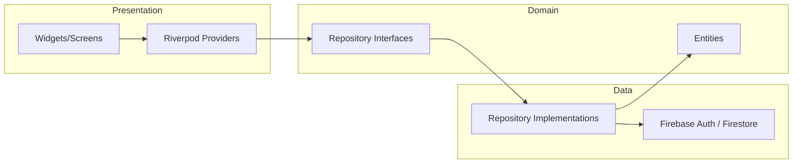

# Architecture and Overview

This document describes the architecture, tech stack, folder structure, Firestore design, and navigation for the Kigali City Services & Places Directory Flutter app. Use it as the single source of truth when implementing.

---

## 1. Clean Architecture Layers

Dependency rule: **Presentation → Domain ← Data**. Domain has no dependencies on Flutter or Firebase.



| Layer | Location | Allowed | Not allowed |
|-------|----------|--------|-------------|
| **Presentation** | `lib/features/*/presentation/` | Flutter widgets, Riverpod, repo interfaces (injected) | Direct Firestore/Auth calls, Firestore types in widgets |
| **Domain** | `lib/features/*/domain/` | Entities (plain Dart), repository **interfaces** | Flutter, Firebase, any platform imports |
| **Data** | `lib/features/*/data/` | Firebase Auth, Firestore, repository **implementations**, mappers | UI logic |

---

## 2. Target Folder Structure (lib)

Create exactly this structure before or during Stage 1:

```
lib/
├── main.dart                    # Bootstrap: Firebase.init, runApp(ProviderScope(child: App()))
├── app.dart                     # MaterialApp, theme, router
├── core/
│   ├── constants/               # App constants, OSM User-Agent, etc.
│   ├── theme/                   # AppTheme (colors, TextTheme)
│   ├── router/                  # GoRouter or route definitions
│   ├── errors/                  # AppException, failure types
│   └── utils/                   # Helpers (e.g. distance calculation)
├── features/
│   ├── auth/
│   │   ├── domain/
│   │   │   ├── entities/
│   │   │   │   └── user_profile.dart
│   │   │   └── repositories/
│   │   │       └── auth_repository.dart        # abstract interface
│   │   ├── data/
│   │   │   ├── repositories/
│   │   │   │   └── firebase_auth_repository.dart
│   │   │   └── datasources/                   # optional: wrap Firebase Auth
│   │   └── presentation/
│   │       ├── providers/
│   │       │   └── auth_providers.dart
│   │       └── screens/
│   │           ├── login_screen.dart
│   │           ├── sign_up_screen.dart
│   │           └── verify_email_screen.dart
│   ├── listings/
│   │   ├── domain/
│   │   │   ├── entities/
│   │   │   │   └── listing.dart
│   │   │   └── repositories/
│   │   │       └── listing_repository.dart     # abstract interface
│   │   ├── data/
│   │   │   ├── repositories/
│   │   │   │   └── firestore_listing_repository.dart
│   │   │   ├── models/                         # Firestore DTOs if needed
│   │   │   └── datasources/
│   │   │       └── listings_firestore_service.dart
│   │   └── presentation/
│   │       ├── providers/
│   │       │   └── listing_providers.dart
│   │       ├── screens/
│   │       │   ├── directory_screen.dart
│   │       │   ├── my_listings_screen.dart
│   │       │   ├── listing_detail_screen.dart
│   │       │   ├── listing_form_screen.dart    # create/edit
│   │       │   └── map_view_screen.dart
│   │       └── widgets/                        # listing card, search bar, etc.
│   └── settings/
│       └── presentation/
│           ├── providers/
│           │   └── settings_providers.dart    # e.g. notification toggle
│           └── screens/
│               └── settings_screen.dart
```

---

## 3. Tech Stack

| Area | Choice | Notes |
|------|--------|-------|
| **State management** | Riverpod | Use `flutter_riverpod` + optional `riverpod_annotation` / `riverpod_generator`. No Firestore in widgets; all via providers. |
| **Routing** | go_router (recommended) or Navigator 2.0 | Bottom nav can switch body by index or use nested routes. |
| **Auth** | Firebase Authentication | Email/password; email verification required before main app. |
| **Database** | Cloud Firestore | Collections: `users`, `listings`. Real-time listeners for listings. |
| **Map display** | flutter_map + OpenStreetMap | No API key for tiles. Set a valid User-Agent for OSM tile requests. |
| **Map POIs (beyond user listings)** | Overpass API | Via `flutter_overpass` or `osm_overpass` (or raw HTTP). Query OSM by viewport/category. |
| **Coordinates** | latlong2 | `LatLng` type for flutter_map and app logic. |
| **Directions** | url_launcher | Open Google Maps or OSM URL for turn-by-turn (no in-app API key). |
| **Location** | geolocator | For device location (e.g. “near you”, map center). |
| **Local preferences** | shared_preferences (or flutter_secure_storage) | Notification toggle simulation. |

Do **not** use `google_maps_flutter` for the in-app map; use flutter_map + OSM so the map can show both Firestore listings and OSM POIs without API key or user-only limitation.

---

## 4. Firestore Collections

### 4.1 `users/{uid}`

Created on first sign-up; read/updated for Settings profile.

| Field | Type | Description |
|-------|------|--------------|
| uid | string | Same as document ID (Firebase Auth UID) |
| email | string | From Firebase Auth |
| displayName | string | Optional; editable in Settings |
| emailVerified | boolean | Mirror of Auth; can be updated on verification |
| createdAt | timestamp | When profile was created |

Security: user can read/write only `users/{request.auth.uid}`.

### 4.2 `listings/{listingId}`

All listing fields required by the assignment.

| Field | Type | Description |
|-------|------|--------------|
| name | string | Place or service name |
| category | string | One of: Hospital, Police Station, Library, Restaurant, Café, Park, Tourist Attraction, etc. (use enum in code, store as string) |
| address | string | Full address |
| contactNumber | string | Phone or contact |
| description | string | Free text |
| latitude | number | Double |
| longitude | number | Double |
| createdBy | string | Firebase Auth UID of creator |
| timestamp | timestamp | Firestore Timestamp (create/update time) |

Security: authenticated users can read all listings; create only with `createdBy == request.auth.uid`; update/delete only when `resource.data.createdBy == request.auth.uid`.

### 4.3 Indexes

- **listings**: composite index on `(category)` for category filter; optionally `(createdBy)` for “my listings” queries. Create via Firebase Console when prompted by first query.

---

## 5. Navigation Map

Required bottom navigation (exactly 4 items):

1. **Directory** – Browse all listings (search + category filter).
2. **My Listings** – List of listings created by the current user; add/edit/delete.
3. **Map View** – Full-screen map: Firestore listings + OSM POIs; tap marker → detail or bottom sheet.
4. **Settings** – User profile (from Firestore/Auth) + location-based notifications toggle (local).

Flow:

- Unauthenticated → Login or Sign up.
- Authenticated but email not verified → Verify email screen (resend link).
- Verified → Main shell with bottom nav; default tab = Directory.

From Directory or Map View: tap listing → Listing detail screen (with map + “Get directions”).  
From My Listings: tap listing → Detail or edit form; delete from detail or list (only if `createdBy == currentUser.uid`).

---

## 6. Data Flow (Listings)

- UI listens to Riverpod providers only.
- Providers call `ListingRepository` (interface) implemented by `FirestoreListingRepository`.
- Repository uses `ListingsFirestoreService` (or equivalent) to perform Firestore snapshot streams and writes.
- Create/update/delete: notifier calls repository then invalidates `listingsStreamProvider` / `myListingsProvider` / `listingDetailProvider` as needed so UI updates in real time.

---

## 7. Document Index

| Document | Purpose |
|----------|---------|
| [00_ARCHITECTURE_AND_OVERVIEW.md](00_ARCHITECTURE_AND_OVERVIEW.md) | This file |
| [01_STAGE_1_PROJECT_SETUP.md](01_STAGE_1_PROJECT_SETUP.md) | Dependencies, Firebase, folder scaffold, theme, router shell |
| [02_STAGE_2_AUTHENTICATION.md](02_STAGE_2_AUTHENTICATION.md) | Auth feature end-to-end |
| [03_STAGE_3_LISTINGS_DOMAIN_AND_DATA.md](03_STAGE_3_LISTINGS_DOMAIN_AND_DATA.md) | Listing entity, repo, Firestore |
| [04_STAGE_4_STATE_MANAGEMENT_AND_CRUD.md](04_STAGE_4_STATE_MANAGEMENT_AND_CRUD.md) | Riverpod providers and CRUD |
| [05_STAGE_5_DIRECTORY_AND_NAVIGATION.md](05_STAGE_5_DIRECTORY_AND_NAVIGATION.md) | Bottom nav, Directory, My Listings |
| [06_STAGE_6_DETAIL_PAGE_AND_MAPS.md](06_STAGE_6_DETAIL_PAGE_AND_MAPS.md) | Detail screen, flutter_map, directions |
| [07_STAGE_7_MAP_VIEW_SETTINGS_AND_POLISH.md](07_STAGE_7_MAP_VIEW_SETTINGS_AND_POLISH.md) | Map View, Settings, README, reflection docs |
| [IMPLEMENTATION_REFLECTION.md](IMPLEMENTATION_REFLECTION.md) | Template: Firebase experience, challenges, fixes |
| [DESIGN_SUMMARY.md](DESIGN_SUMMARY.md) | Template: Firestore, state management, trade-offs |
